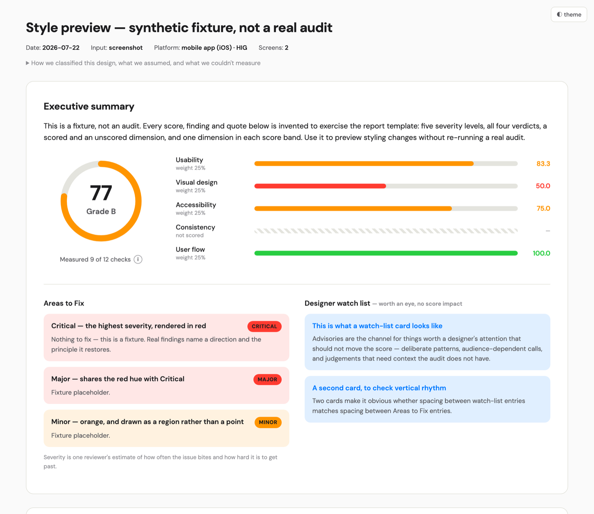

# design-audit

A Claude Code plugin that runs a **research-backed design audit** of an interface and
produces two things: a cited scorecard in chat, and a self-contained annotated HTML
report you can send to anyone.

Built by Clemens Chen. Every criterion, threshold, and weight traces to a published
source — the provenance lives in [`research/`](research/), which the skill never loads.

## See a sample report

[](https://clemnsc1617.github.io/design-audit/sample-report.html)

**[▶ Open the interactive sample →](https://clemnsc1617.github.io/design-audit/sample-report.html)** — click the markers, switch scorecard tabs, toggle light/dark. It runs on synthetic data (placeholder screens) to show the format, not a real audit.

## What it does

Give it a screenshot, a URL, a Figma link, or a screen recording. It will:

1. **Capture and normalize** the input into ordered screens (URLs are captured at
   desktop and mobile widths; long pages as per-viewport sections).
2. **Classify the platform** — mobile app (iOS/Android), mobile web, desktop web,
   desktop app, or a responsive pair — and apply that platform's convention set
   (Apple HIG, Material 3, or web + WCAG). Thresholds genuinely differ: a 32px
   button passes a web audit and fails both native guidelines.
3. **Evaluate 63 criteria** across five dimensions, one dimension at a time:
   usability (14), visual design (12), accessibility (14, WCAG 2.2 AA),
   consistency (12), user flow (11).
4. **Score** each dimension (pass 1 / partial 0.5 / fail 0; not-applicable excluded)
   and combine them into a weighted 0–100 with a letter grade.
5. **Report** — a chat scorecard plus an HTML file: executive summary, annotated
   screens with numbered markers, a designer watch list, the full scorecard in
   per-dimension tabs, and the flow section.

Single screens and ordered multi-screen flows are handled differently: a flow gets
cross-screen criteria (continuity, state persistence, step order) and a
missing-flows list — the error, empty, and cancel states the sequence implies but
never shows.

## Install

```bash
# Try it without installing (session only)
claude --plugin-dir /path/to/design-audit-plugin

# Or install persistently from this repo as a local marketplace
claude plugin marketplace add /path/to/design-audit-plugin
claude plugin install design-audit@design-audit-plugin
```

Requires Python 3 (stdlib only) for the report build. URL capture uses the in-app
browser or headless Chrome; Figma capture needs the Figma MCP server authorized.

## How to use

Ask for an audit in plain language and hand over one input:

```
audit this screenshot
run a design audit on https://example.com
score this UI against usability and accessibility
grade these three screens as a flow
```

The trigger is the intent to *audit / score / grade / evaluate* — a casual "what do
you think of this?" deliberately won't start it (that's ordinary critique).

**Inputs it accepts:**

- **A screenshot** — a file path, or an image pasted straight into chat. If you
  paste one, the audit runs on what it sees; for the HTML report it needs the file
  on disk, so it will offer to find it in the usual places (Downloads, Desktop, the
  project) or take a path from you. It never fabricates a mock UI.
- **A URL** — captured at desktop and mobile widths; long pages as per-viewport
  sections.
- **A Figma link** — needs the Figma MCP server authorized in your session.
- **A screen recording** — distinct screens are pulled as ordered frames.

**One flow, or several screens?** For more than one screen it will ask whether they
form an ordered flow. If they do, you get the cross-screen checks (continuity, state
persistence, step order) and a missing-flows list. Order matters, so give them in
sequence.

**What you get back:**

1. A short summary in chat: the input, how the platform was classified, what was
   assumed, what couldn't be measured, and the overall score and grade.
2. A self-contained `report.html` next to your input: executive summary, the
   annotated screenshot with numbered markers, a designer watch list, the full
   scorecard in per-dimension tabs, and the flow section. It embeds its own image
   and font, so you can send the single file to anyone. It offers to publish as a
   shareable Artifact — your call, never automatic.

## What it is honest about

The audit only scores what the evidence supports, and says so everywhere:

- **Coverage is printed next to the score** (e.g. "measured 50 of 63 checks"). A
  sparse screen scores against a smaller denominator — compare coverage before
  comparing scores.
- **Not-applicable always carries a reason**: needs DOM data, needs a state that
  wasn't captured, applies only to multi-screen sets, or doesn't apply on this
  platform.
- **Never statically assessable** (never scored, always disclosed): text resize to
  200%, reflow, keyboard operability, on-focus/on-input behavior.
- **Scores are directional** — roughly ±5 points between runs, so neighboring
  grades read the same. Grade bands (A 90–100, B 75–89, C 60–74, D 40–59, F <40)
  are conventions, not a normed instrument.
- **Severity is one evaluator's estimate** (Nielsen's frequency × impact ×
  persistence), used to rank findings — never folded into the score, because
  single-evaluator severity ratings are known to be unreliable.
- **Marker placement is "this area", not "this pixel"** — visual estimation runs
  ±3–5%; region boxes and the verification loop mitigate it, and DOM/Figma geometry
  is used whenever available.

If an image is pasted into chat rather than saved as a file, the audit still runs.
The report needs a real file to embed, so it offers to find the file (with your
confirmation) or takes a path from you, and never fabricates a mock.

## Scoring

Equal weights: five dimensions at 20% each. Single-screen audits evaluate user flow
but leave it unscored, redistributing to 25% × 4 — a single screen can't demonstrate
cross-screen continuity. Any dimension with no applicable criteria drops out and its
weight spreads over the rest.

Equal weighting is deliberate: the research pass found no citable basis for fixed
unequal weights, and the standardized instruments in the field (SUS, UMUX) are
themselves unweighted. The derivation, alternatives considered (including AHP-elicited
weights), and their critiques are in [`research/weighting-memo.md`](research/weighting-memo.md).

## Restyling the report

Everything visual lives at the top of `skills/design-audit/assets/report-template.html`:
CSS variables for surfaces, ink, and the pass/partial/fail colors, and one `font`
declaration on `body`. Swap them for your brand — re-validate contrast if you change
the status colors, and embed any webfont as a `data:` URI so the report stays
self-contained.

## Repository layout

```
.claude-plugin/          plugin.json + marketplace.json (this repo is its own marketplace)
skills/design-audit/
  SKILL.md               orchestration, steps 0–6
  references/            the rubric: one file per dimension, plus platforms, scoring, input-capture
  assets/                report template + findings schema
  scripts/                build_report.py (findings.json → HTML), measure.py (pixel
                          contrast/size), preview_markers.py (marker check), pngio.py
  evals/evals.json       judged test cases, including regressions worth keeping fixed
fixtures/                a synthetic findings.json for previewing template changes
research/                deep-research provenance — never loaded by the skill
PLAN.md, CLAUDE.md       build plan and working agreement
```

## Sources

Criteria are grounded in W3C WCAG 2.2, Apple Human Interface Guidelines, Material
Design 3, Nielsen Norman Group, Nielsen's heuristics and severity-rating method,
Krug's *Don't Make Me Think*, Laws of UX, and Butterick/Bringhurst on typography.
Each criterion cites its source inline; the long-form source lists live in
[`research/reference-sources.md`](research/reference-sources.md), kept out of the
skill's load path.
